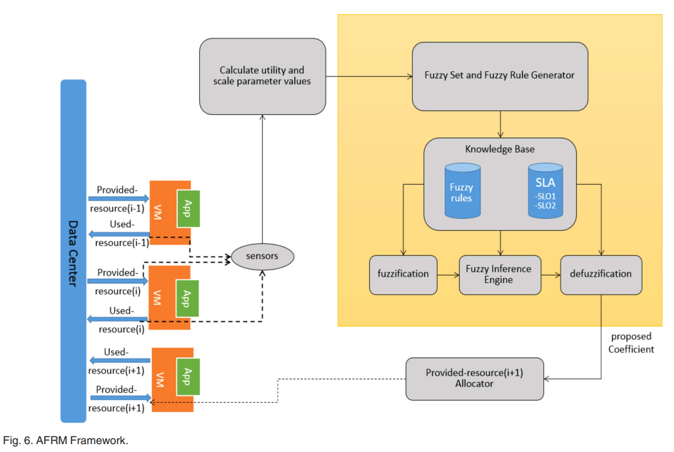

# AFRM: Adaptive and Fuzzy Resource Management in Cloud Computing

This repository contains the source code, documentation, and supplementary material for the paper:

> **"An Adaptive and Fuzzy Resource Management Approach in Cloud Computing"**  
> Parinaz Haratian, Faramarz Safi-Esfahani, Leili Salimian, and Akbar Nabiollahi  
> _IEEE Transactions on Cloud Computing, Vol. 7, No. 4, 2019_  
> DOI: [10.1109/TCC.2017.2735406](https://doi.org/10.1109/TCC.2017.2735406)

---

## 📜 Abstract

Cloud computing environments face performance degradation due to dynamic and unpredictable workloads. To address this, we propose an **Adaptive and Fuzzy Resource Management (AFRM)** framework that dynamically reallocates resources using a fuzzy knowledge management system. AFRM aims to reduce SLA violations and optimize resource allocation efficiency by autonomously adjusting resource provisioning based on real-time workload patterns.

---

## 🧠 AFRM Framework Overview

The AFRM framework integrates:

- A **self-adaptive control cycle**
- A **fuzzy inference engine** for rule generation
- SLA-driven **knowledge base**
- Real-time **sensing and feedback**
- Dynamic calculation of **utility** and **scale parameters**



---

## 📁 Project Structure

```
AFRM/
├── src/                       # Source code for simulation
│   ├── AFRM.java             # Main simulation engine
│   ├── FuzzyController.java  # Fuzzy logic controller
│   └── WorkloadGenerator.java
├── fuzzy/                    # Fuzzy logic configuration files
│   └── afrm_rules.fcl        # Fuzzy rule base (for jFuzzyLogic)
├── data/                     # Workload traces and result logs
│   └── sample_workload.csv
├── diagrams/
│   └── AFRM_framework.png    # Main framework figure
├── paper/
│   └── AFRM_published.pdf    # Final paper (IEEE TCC 2019)
└── README.md
```

---

## ⚙️ Requirements

- Java 8+
- [CloudSim Toolkit](https://www.cloudbus.org/cloudsim/)
- [jFuzzyLogic](http://jfuzzylogic.sourceforge.net/html/index.html)

---

## 🚀 Getting Started

1. **Clone the repository:**

   ```bash
   git clone https://github.com/yourusername/AFRM.git
   cd AFRM
   ```

2. **Compile and Run:**

   Use any Java IDE or command-line tools like:

   ```bash
   javac -cp "lib/*" src/*.java
   java -cp "lib/*:src" AFRM
   ```

3. **Output:**

   - Simulation logs are saved under `./data/`
   - You can configure workload settings via `WorkloadGenerator.java`

---

## 📊 Evaluation Metrics

AFRM is evaluated against Rule-based and Static-Fuzzy approaches using:

- ✅ SLA Violation Rate  
- ⚙️ Resource Allocation Efficiency (RAE)  
- 📉 Utility (% of used vs. allocated resources)  
- 💰 Cost Function (cloudEUR)

---

## 📚 Citation

If you use this work, please cite the following:

```bibtex
@article{haratian2019adaptive,
  title={An Adaptive and Fuzzy Resource Management Approach in Cloud Computing},
  author={Haratian, Parinaz and Safi-Esfahani, Faramarz and Salimian, Leili and Nabiollahi, Akbar},
  journal={IEEE Transactions on Cloud Computing},
  volume={7},
  number={4},
  pages={907--920},
  year={2019},
  publisher={IEEE},
  doi={10.1109/TCC.2017.2735406}
}
```

---

## 📬 Contact

For questions, suggestions, or collaborations, please contact:

- **Faramarz Safi-Esfahani** – [faramarz.safiesfahani@uts.edu.au](mailto:faramarz.safiesfahani@uts.edu.au)

---

## 📄 License

This project is for academic and research use only. Redistribution or commercial use requires permission from the authors and IEEE.

---
